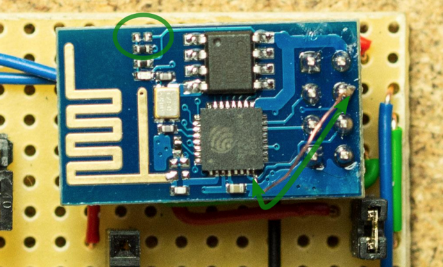

Appendices
----------

Deep sleep
..........

   from http://hackaday.com/2015/02/08/hack-allows-esp-01-to-go-to-deep-sleep/

You can enable the esp8266-01 to deep sleep by soldering off the part circled with green and providing a wire from as shown in green in the lower right corner.

Footnotes
.........

